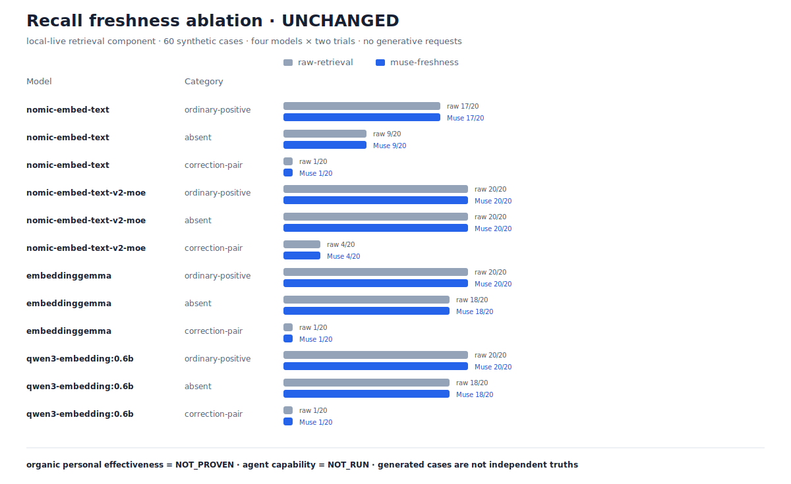

  

# Muse

  <b>暮らし方と働き方を学び、いつ、どのように手伝うべきかを少しずつ合わせていくパーソナル AI。</b> 
  <i>ローカルファースト、プロバイダー非依存。そして、まだできないことを曖昧にしません。</i>

  <a href="README.md">English</a> ·
  <a href="README.ko.md">한국어</a> ·
  <strong>日本語</strong> ·
  <a href="README.zh-CN.md">简体中文</a>

Muse は仕事専用のアシスタントではなく、一人の生活と仕事を継続して支えるエージェントです。目標は <strong>Attunement（歩調合わせ）</strong>。何を知っているかだけでなく、助けが合う場面、静かにしているほうがよい場面、前回の提案が本当に役立ったかを学ぶことを目指します。

最初の具体的な体験が <strong>Personal Continuity</strong> です。ユーザー自身が <code>life</code> または <code>work</code> の未完了テーマを作り、ローカルのタスクやノートを正確に結び付けます。Muse はそのリンクだけを使って、再開に必要な文脈と安全な次の一歩を提示します。テーマの自動検出、常時観察、最適なタイミングの推定はまだロードマップです。

> **現在利用できるもの:** パーソナルメモリ、根拠付きリコール、ローカルの個人用ストア、ガード付きツール／ブラウザー操作、トレース、チェックポイント、そして明示的に開始する Personal Continuity の最初の経路。詳しくは [Attunement のプロダクト契約](docs/strategy/attunement.md) と [実装計画](docs/goals/attunement-implementation-plan.md) を参照してください。

---

## 📊 数字で見る Muse

ここにある六つの図は、すべて別の問いに答えます。テスト件数はエージェントの効果を証明しません。合成データでの結果を、実生活での効果に読み替えることもできません。最新のエージェント評価は **10/11** ですが、総合判定は **FAILED** のままです。個人の生活で役立つことは **NOT_PROVEN**（未証明）です。

### コンポーネント効果の差分

**意味:** 特定の部品を有効にしたとき、その部品だけで測定値がどれだけ変わったかを示します。 **例:** 通院準備のノートや仕事上の決定メモについて質問したとき、根拠のない断言を減らせるかを管理されたローカルモデル用コーパスで比較します。 **読み方:** 正の値はその行の指標が改善したという意味ですが、行ごとに尺度とコーパスが違うため足したり大小を直接比較したりできません。 **現在:** grounding の faithfulness 差分は **+0.94** と **+0.63**、recall correction の差分は **+0.00** です。 **示せること:** 限定条件では grounding コンポーネントが根拠整合性を改善したこと。 **示せないこと:** Muse 全体の品質、日常での有用性、モデル間の優劣、organic な効果。

出典: [canonical dashboard JSON](docs/benchmarks/evidence-dashboard.json) · 再生成 <code>pnpm evidence:dashboard:render</code> · 検証 <code>pnpm evidence:dashboard:validate</code>

### エビデンスの範囲

**意味:** ソフトウェア保証、管理された合成評価、ローカル実行、個人の実利用という異なる証拠クラスに、どれだけの観測があるかを示します。 **例:** <code>life</code> の通院準備と <code>work</code> の設計作業でテストが通っても、それだけで日常の助けが有用だったとは数えません。 **読み方:** 各棒は固有の分母に対する分子で、別の行とは比較できません。 **現在:** エージェント軸 **10/11**、raw top-4 pair retention **8/80**、provenance isolation **10,080/10,080**、organic classification **0/1,000** です。 **示せること:** 各証拠クラスに何があり、どこが不足しているか。 **示せないこと:** 件数の多さから user benefit を結論づけること、technical evidence を organic effectiveness に昇格すること。

出典: [canonical dashboard JSON](docs/benchmarks/evidence-dashboard.json)

### プロダクション経路のリコール

**意味:** 実際の <code>prepareGroundedRecall</code> 経路で、通常質問、答えがない質問、古い情報を訂正する質問を処理した結果です。 **例:** 「今の歯科予約は 15 時」というノートと「以前は 14 時だった」というノートがあるとき、両方を候補に残し、現在の情報を先頭にできるかを測ります。 **読み方:** 色付きの棒は一つの埋め込みモデルにつき 20 件中何件通ったかを表します。 **現在:** correction pair retention は **0/20、0/20、1/20、1/20**、current top-1 は四モデルすべて **0/20** でした。 **示せること:** 凍結した synthetic v1 を production seam に通したときの候補保持と判定の弱点。 **示せないこと:** held-out 性、エージェント全体の能力、生成回答の品質、個人データでの効果。生成回答リクエストは 0 件です。

出典: [canonical production-path JSON](docs/benchmarks/recall-production-path.json) · 再実行 <code>pnpm eval:recall-production-path</code> · 検証 <code>pnpm eval:recall-production-path:validate</code>

<b>詳細な診断</b>

### 鮮度処理のアブレーション

**意味:** 同じ raw top-4 候補に対し、そのままの順位と Muse の freshness 並べ替えを比較します。 **例:** 昔の出張便と現在の出張便が候補に両方残っていれば古い方を下げられますが、現在の便が top-4 から消えていれば並べ替えでは戻せません。 **読み方:** ペアの棒は同一ケースの raw と Muse を示し、平均だけでモデル別の悪化を隠せません。 **現在:** 四モデルとも差分 0 で **UNCHANGED**、correction 観測の **72/80** が <code>PAIR_MISSING</code> でした。 **示せること:** 測定されたボトルネックが stale reordering より前の retrieval/MMR pair retention にあること。 **示せないこと:** freshness の考え方が常に無効であること、この synthetic component 診断が agent evaluation であること。

出典: [canonical freshness JSON](docs/benchmarks/recall-freshness-ablation.json)

### 候補プール診断

**意味:** <code>topK</code> を **4、8、12** と広げたとき、current/stale の組を候補に残しやすくなるかを調べます。 **例:** 家族旅行の最新ホテル候補と取り消した旧候補を一緒に確認したいとき、候補枠が狭すぎて最新情報が落ちる問題を切り分けます。 **読み方:** correction pass は pair が残り、かつ current が top-1 の場合だけです。 **現在:** pair retention は概して topK とともに増加し、例えば v2-moe は 5/20 → 13/20 → 17/20。一方、各 topK で raw と Muse の current-top1 は同数でした。 **示せること:** 候補幅を増やすと pair retention が改善し得ること。 **示せないこと:** freshness 並べ替え固有の効果、最適な production topK、個人利用での正答率。

出典: [canonical candidate-pool JSON](docs/benchmarks/recall-candidate-pool.json)

### プロジェクトの実装面

**意味:** 公開されている機能面と、ある時点のソフトウェア保証スナップショットを並べた在庫表です。 **例:** ローカルのカレンダー接続方式が複数あることは分かりますが、誕生日計画の再開を上手に助けた回数ではありません。 **読み方:** 各カードは単位が異なり、<code>NOT_RUN</code> は失敗率ではなく未実行の状態です。 **現在:** 図にはエンドポイント、パッケージ／アプリ、MCP サーバー、プロバイダー分類、過去に通過したテストのスナップショット、ライブコマンドの利用可否が記録され、実 LLM の往復実行は **NOT_RUN** です。 **示せること:** 実装の広さ、コマンドの存在、履歴時点でのソフトウェア保証。 **示せないこと:** 機能数やテスト数が利用者への効果、品質、信頼性を直接保証すること。

出典: [canonical dashboard JSON](docs/benchmarks/evidence-dashboard.json)

証拠クラスと昇格禁止ルールは [エビデンス索引](docs/benchmarks/EVIDENCE.md) にあります。canonical JSON だけが数値の正本で、CSV、Markdown、SVG はそこから派生し、照合されます。

**管理された合成データの規模:** 6 種類のテスト群 × 4 言語 × 4 段階の複雑さを、互いに独立した 1千・1万・10万・100万件のコーパスで検証しました。たとえば、架空の通院予定について古い時刻と訂正後の時刻を区別するケースや、答えのない質問には推測で答えないケースを含みます。合計 **1,111,000件**を生成・直列化・再読込・スキーマ検証し、層別抽出した **768/768件**が名前を明記した Muse の公開境界と最終不変条件を通過しました。LLM・ツール・ネットワーク呼び出しは 0 回、bulk データは 1,338,728,855 bytes、peak RSS は 429,572,096 bytes で、所有者の状態は byte-stable でした。生成器の fixture 修正後に別枠で実行した fresh-seed replay も **1,000/1,000件**のスキーマ検証と **192/192件**の公開境界を通過しましたが、これは `robustnessReplay=true`、`heldOut=false` であり、111万1千件の合計には含みません。ここで示せるのはストリーミング／コーパス完全性、公開境界の標本実行、再現性までです。個人学習、held-out 一般化、organic effectiveness、あるいは 111万1千回のエージェント実行を示すものではありません。[正本 JSON](docs/benchmarks/eval-datasets-scale-v1.json) · [読みやすいレポート](docs/benchmarks/eval-datasets-scale-v1.md)

### 今、Muse を使う理由

現在の価値は、Muse に生活や仕事を勝手に推測させることではありません。自分で <code>life</code> / <code>work</code> のテーマを作り、再開に必要なローカルのタスクやノートだけを正確に結び付け、外部への作用は承認の範囲内に止められることです。たとえば通院準備や中断した設計作業に戻るとき、関係のない記憶を混ぜずに「どこまで進んだか」と次の一歩を確認できます。

一方、長期的に役立つこと、自然なタイミングを学べること、使うほど生活に合うことは **NOT_PROVEN** です。現在提供するのは、ユーザーが主導権を保ったまま試せる明示的で監査可能な Continuity 経路です。

---

## ⚡ インストールとクイックスタート

~~~bash
# 必要環境: Git + Node.js >= 22.12（Node 24 LTS 推奨）+ pnpm 10
git clone https://github.com/wlsdks/muse-agent.git
cd muse-agent
corepack enable
pnpm install:muse
muse onboard
~~~

対応しているソースインストールは clean な <code>main</code> を使い、依存関係を frozen install し、workspace を build して CLI を link・検証します。事前確認は <code>pnpm install:muse -- --dry-run</code>、更新は <code>muse update</code>、ローカルデモは <code>pnpm demo</code> です。

明示的な Continuity thread を始める例:

~~~bash
muse thread start "誕生日の計画" --kind life
muse thread link <thread-id> note birthday.md --role context
muse thread link <thread-id> task <task-id> --role next-step
muse continue <thread-id>
muse thread outcome <delivery-id> used
~~~

そのほかのローカル実行:

~~~bash
muse chat --local --user me
muse status --user me
muse proactive watch --user me --interval 60
~~~

<code>muse ask</code> は参照元を明記し、開ける receipt とともに grounded answer を返します。

---

## 🔧 主な機能

- **プロバイダー非依存の推論:** OpenAI、Anthropic、Gemini、OpenRouter、Ollama、LM Studio、OpenAI-compatible endpoint を一つの <code>ModelProvider</code> 境界で扱います。
- **Personal Continuity とメモリ:** 明示的な life/work thread、正確なローカル source link、outcome、fact、preference、veto、goal。
- **根拠付きリコール:** ローカルノートの ranking、confidence gate、freshness、citation。証拠が弱いときに自信のある回答を作りません。
- **個人用ツール:** ローカルの note、task、reminder、contact と、五種類の calendar backend。
- **ガードされた操作:** fail-close guard、fail-open hook、明示的 approval、untrusted tool output、loop/timeout 上限、trace。
- **一つの runtime:** CLI、API/web chat、messaging、scheduled job、delegated worker は同じ composition root を共有します。
- **双方向 MCP:** built-in <code>muse.*</code> tool と、他の agent に read-only recall/search/user-model access を提供する <code>muse mcp serve</code>。
- **ローカルファースト:** file-backed personal store は cloud account なしで動作し、<code>MUSE_LOCAL_ONLY=true</code> は cloud model provider を拒否します。

## Muse がしないこと（境界）

- **資金を動かしません。** 金融口座への接続、支払い、送金は行いません。
- **第三者へ自律送信しません。** メール、チャット、フォーム、予約は draft-first。送信先と本文をユーザーが確認します。
- **Continuity を勝手に推測しません。** thread と source link はユーザーが作成します。自動検出は将来の opt-in 機能です。
- **一人、一環境向けです。** multi-tenant workspace、共有アカウント、RBAC の製品ではありません。
- **証拠クラスを混ぜません。** software test、synthetic replay、component diagnostic、agent trial、organic outcome は別々に扱います。

強制される境界は [outbound safety](.claude/rules/outbound-safety.md) と [Attunement 設計](docs/design/attunement.md) を参照してください。

## 🧩 プロバイダーとローカル実行

<code>MUSE_MODEL=&lt;provider&gt;/&lt;model&gt;</code> と通常の API key 環境変数で provider を選びます。<code>MUSE_MODEL_PROVIDER_ID</code>、<code>MUSE_MODEL_API_KEY</code>、<code>MUSE_MODEL_BASE_URL</code> で明示的に上書きできます。cloud provider と <code>MUSE_LOCAL_ONLY=true</code> は併用できません。

Ollama を使う無料・オフライン経路:

~~~bash
brew install ollama
ollama serve &
ollama pull gemma4:12b
muse setup local
~~~

個人データは標準で file-backed です。notes は <code>~/.muse/notes/</code>、tasks は <code>~/.muse/tasks.json</code>、reminders は <code>~/.muse/reminders.json</code>、memory は <code>~/.muse/user-memory.json</code> に保存されます。<code>muse setup calendar</code> は Local、Local-ICS、Google、CalDAV、macOS Calendar に対応します。Windows では CLI、API、recall、Ollama、opt-in PowerShell actuator が利用でき、macOS 専用 mirror は自動で無効になります。

モデルの tier、license、latency、troubleshooting は [ローカルモデル設定](docs/setup-local-llm.md) にあります。

## ✅ 検証

編集時は狭い gate、merge 前は full gate を使います。

~~~bash
pnpm typecheck:fast
pnpm test:changed
pnpm check
pnpm smoke:broad
pnpm smoke:live
~~~

<code>smoke:live</code> はローカルの Ollama を明示的に使用し、接続できなければスキップします。時間のかかる <code>pnpm eval:agent</code> は夜間または手動実行向けです。最新の有効なエージェント評価は 10 件合格、1 件不合格、未確認 0 件、つまり **10/11**。総合判定は **FAILED** のままです。

## 📖 ドキュメント

- [Attunement のプロダクト契約](docs/strategy/attunement.md)
- [Attunement のアーキテクチャと現在の gap](docs/design/attunement.md)
- [Attunement 実装計画](docs/goals/attunement-implementation-plan.md)
- [システムマップ](docs/SYSTEM-MAP.md)
- [検証済み feature catalog](docs/feature-catalog/INDEX.md)
- [エビデンス索引](docs/benchmarks/EVIDENCE.md)
- [セキュリティ方針](SECURITY.md)

## 💬 コミュニティとサポート

質問、bug、feature idea は [GitHub Issues](https://github.com/wlsdks/Muse/issues) へ。脆弱性は公開 issue ではなく [SECURITY.md](SECURITY.md) の方法で報告してください。

## コントリビューション

変更前に [CONTRIBUTING.md](CONTRIBUTING.md)、[CLAUDE.md](CLAUDE.md)、[domain rules](.claude/rules/) を読んでください。Conventional Commits を使い、commit と PR の説明は英語で記述します。

## ライセンス

[MIT](LICENSE)。runtime、adapter、tooling は open source で、contribution も同じ条件で受け入れます。
