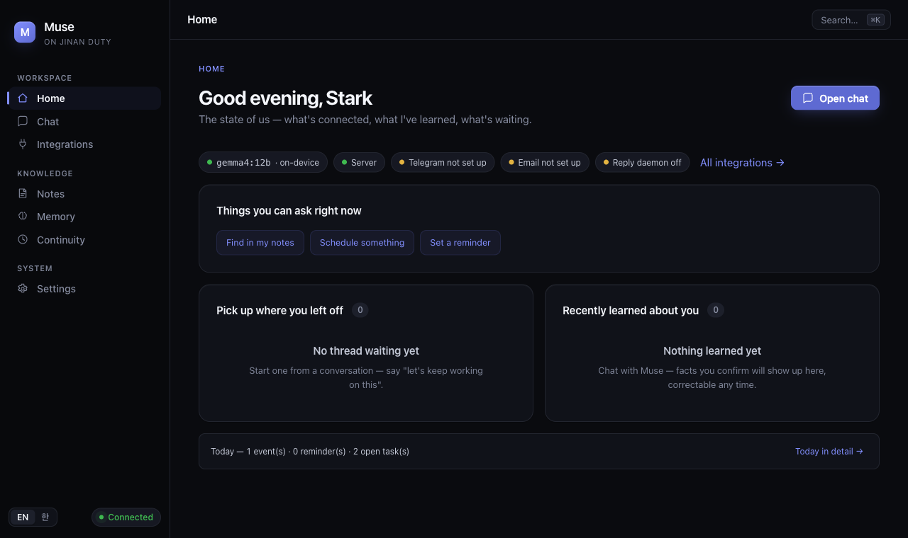
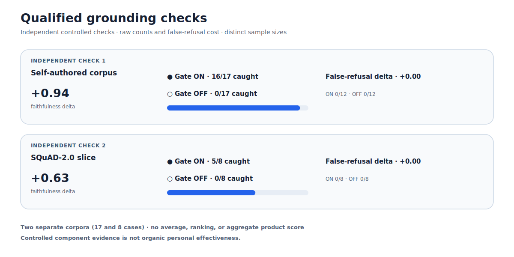
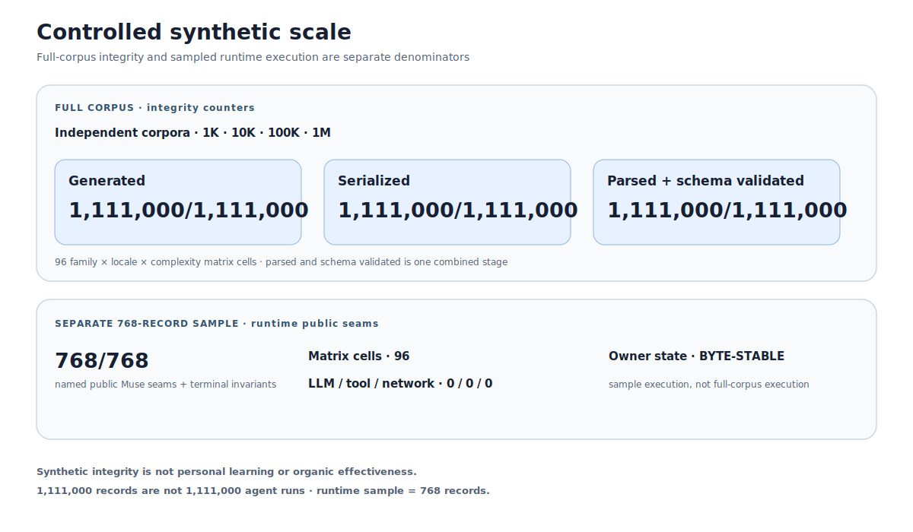
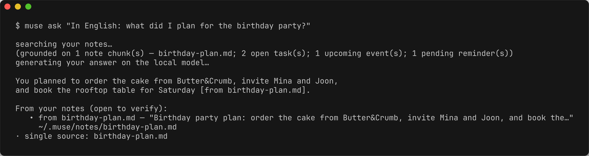

<p align="center">
  
</p>

<p align="center"><i>지금 살고 있는 삶을 이해하려는 개인 AI, Muse를 만나보세요.</i></p>

<h1 align="center">Muse</h1>

<p align="center">
  <b>당신이 살아가고 일하는 방식을 배우며, 언제 어떻게 도울지 점점 더 잘 맞추는 개인 AI.</b><br/>
  <i>로컬 우선, 모델 제공자 중립, 아직 완성되지 않은 부분은 솔직하게.</i>
</p>

<p align="center">
  <a href="LICENSE"></a>
  <a href="package.json"></a>
  <a href="https://www.typescriptlang.org/"></a>
  <a href="#muse가-하지-않는-일"></a>
  <a href="https://ollama.com"></a>
  &nbsp;·&nbsp; <a href="README.md">English</a>
  &nbsp;·&nbsp; <b>한국어</b>
  &nbsp;·&nbsp; <a href="README.ja.md">日本語</a>
  &nbsp;·&nbsp; <a href="README.zh-CN.md">简体中文</a>
</p>

Muse는 업무만 처리하는 비서가 아니라, 한 사람의 삶과 일을 계속 이어서 이해하는 개인 에이전트입니다. 제품의 중심에는 **Attunement(조율)**가 있습니다. 도움이 필요한 순간과 조용히 있어야 할 순간을 구분하고, 지난 제안이 실제로 도움이 되었는지 배워 가려는 방향입니다.

첫 번째 증명점은 **Personal Continuity(개인 맥락 이어가기)**입니다. 사용자가 삶 또는 업무 주제를 직접 만들고, 정확한 로컬 할 일과 메모를 연결하면 Muse가 다음에 그 일을 이어갈 수 있습니다. 주제를 자동으로 추측하거나 사용자를 관찰해 타이밍을 정하는 기능은 아직 로드맵에 있습니다.

> **지금 동작하는 것:** 개인 기억, 출처가 붙는 회상, 로컬 개인 저장소, 승인과 보호 장치가 있는 도구·브라우저 행동, 실행 기록, 체크포인트, 명시적으로 시작하는 Personal Continuity 경로. 자세한 범위는 [제품 계약](docs/strategy/attunement.md)과 [구현 계획](docs/goals/attunement-implementation-plan.md)에서 확인할 수 있습니다.

<p align="center"></p>

---

## 📊 숫자로 보는 Muse

README에는 자격이 확인된 통제 결과 두 개만 싣습니다. 실패·변화 없음·진단용 근거는 그래프로 승격하지 않고 [근거 색인](docs/benchmarks/EVIDENCE.md)에 그대로 공개합니다.

### 자격이 확인된 grounding

**예시:** 같은 가상 예약 질문에서 grounding은 근거 없는 추측 대신 연결된 메모를 인용해야 합니다. 서로 독립적인 두 통제 검사에서 faithfulness는 자체 작성 사례 **ON 16/17, OFF 0/17**로 **+0.94**, squad 사례 **ON 5/8, OFF 0/8**로 **+0.63**이었습니다. False-refusal 비용은 각각 **0/12 대 0/12**, **0/8 대 0/8**로 둘 다 **+0.00**이었습니다. 두 검사는 분모가 다르며 합산 점수가 아닙니다.



원본: [닫힌 README 근거 manifest](docs/benchmarks/readme-qualified-evidence-v1.json) · [전체 근거 색인](docs/benchmarks/EVIDENCE.md)

### 통제 합성 데이터 규모 무결성

**예시:** 가상의 예약 교정 레코드는 개인 데이터를 건드리지 않고 현재 시간과 이전 시간을 구분하는지 검사합니다. 서로 독립적인 **1K / 10K / 100K / 1M** corpus 전체에서 생성·직렬화·파싱 + 스키마 검증은 각각 **1,111,000/1,111,000건**이었습니다. 이 전체 corpus와 별도로 뽑은 runtime 표본은 **96**개 셀에서 이름이 명시된 Muse 공개 경계 **768/768건**을 통과했습니다. LLM·도구·네트워크 호출은 **0 / 0 / 0**이었고 사용자 상태는 **byte-stable**이었습니다.



원본: [기준 scale JSON](docs/benchmarks/eval-datasets-scale-v1.json) · [닫힌 README 근거 manifest](docs/benchmarks/readme-qualified-evidence-v1.json) · [전체 근거 색인](docs/benchmarks/EVIDENCE.md)

경계: 에이전트 종합은 **10/11 FAILED**, 실제 사용 효과는 **NOT_PROVEN**, recall correction은 **UNQUALIFIED**입니다. 통제 합성 무결성은 개인 학습이 아닙니다. 통제 근거는 실제 사용 효과가 아닙니다. **1,111,000개 레코드는 1,111,000번의 에이전트 실행이 아닙니다.**

---

## ⚡ 설치와 빠른 시작

```bash
# 필요 환경: Git + Node.js >= 22.12(24 LTS 권장) + pnpm 10
git clone https://github.com/wlsdks/muse-agent.git
cd muse-agent
corepack enable
pnpm install:muse
muse onboard
```

지원되는 소스 설치는 깨끗한 `main`에서 고정된 의존성을 설치하고, 전체 workspace를 빌드한 뒤 CLI를 연결하고 확인합니다. `pnpm install:muse -- --dry-run`으로 미리 보고, `muse update`로 업데이트하거나 `pnpm demo`로 로컬 데모를 실행할 수 있습니다.

직접 고른 주제를 이어가려면 다음처럼 시작합니다.

```bash
muse thread start "Plan a birthday" --kind life
muse thread link <thread-id> note birthday.md --role context
muse thread link <thread-id> task <task-id> --role next-step
muse continue <thread-id>
muse thread outcome <delivery-id> used
```

그 밖의 로컬 사용 예:

```bash
muse chat --local --user me
muse status --user me
muse proactive watch --user me --interval 60
```

`muse ask`는 출처가 붙고 열어 볼 수 있는 답을 돌려줍니다.

<p align="center"></p>

---

## 🔧 핵심 기능

- **모델 제공자 중립 추론:** OpenAI, Anthropic, Gemini, OpenRouter, Ollama, LM Studio, OpenAI 호환 엔드포인트를 하나의 `ModelProvider` 경계로 연결합니다.
- **개인 맥락과 기억:** 명시적인 삶·업무 주제, 정확한 로컬 출처 링크, 결과, 사실, 선호, 금지, 목표를 다룹니다.
- **근거 기반 회상:** 로컬 메모를 순위화하고, 근거가 약하면 자신 있게 답하지 않으며, 최신성과 인용 출처를 함께 처리합니다.
- **개인 도구:** 로컬 메모, 할 일, 알림, 연락처와 다섯 종류 캘린더 백엔드를 같은 인터페이스 뒤에 둡니다.
- **보호된 행동:** fail-close guard, fail-open hook, 명시적 승인, 신뢰하지 않는 도구 출력, 반복·시간 제한, 추적 기록을 적용합니다.
- **하나의 런타임:** CLI, API·웹 채팅, 메시징, 예약 작업, 위임 워커가 같은 구성 루트를 사용합니다.
- **양방향 MCP:** 내장 `muse.*` 도구를 쓰고, `muse mcp serve`로 다른 에이전트에 읽기 전용 회상·검색·사용자 모델을 제공할 수 있습니다.
- **로컬 우선:** 개인 저장소는 클라우드 계정 없이 작동하며 `MUSE_LOCAL_ONLY=true`는 클라우드 모델 제공자를 거부합니다.

## Muse가 하지 않는 일

- **돈을 움직이지 않습니다.** 금융 계정 연결, 결제 실행, 송금은 범위 밖입니다.
- **다른 사람에게 몰래 보내지 않습니다.** 이메일, 채팅, 폼, 예약은 먼저 초안을 만들고 정확한 내용과 수신자를 확인받습니다.
- **이어갈 주제를 숨겨서 추측하지 않습니다.** 현재 주제와 출처 링크는 사용자가 직접 만듭니다. 자동 감지는 나중의 선택 기능입니다.
- **여러 사람이 함께 쓰는 서비스가 아닙니다.** 한 사용자, 한 로컬 환경을 위한 제품이며 공유 계정이나 RBAC 모델이 없습니다.
- **서로 다른 근거를 바꿔 부르지 않습니다.** 소프트웨어 테스트, 합성 재생, 구성 요소 진단, 에이전트 시험, 실제 사용 결과는 계속 분리합니다.

강제되는 경계는 [외부 전송 안전 규칙](.claude/rules/outbound-safety.md)과 [Attunement 설계](docs/design/attunement.md)에 설명되어 있습니다.

---

## 🧩 모델 제공자와 로컬 사용

`MUSE_MODEL=<provider>/<model>`과 각 제공자의 일반 API 키 환경 변수로 모델을 선택합니다. 명시적 덮어쓰기는 `MUSE_MODEL_PROVIDER_ID`, `MUSE_MODEL_API_KEY`, `MUSE_MODEL_BASE_URL`을 사용합니다. `MUSE_LOCAL_ONLY=true`에서는 클라우드 모델을 쓸 수 없습니다.

Ollama를 이용한 무료 오프라인 경로:

```bash
brew install ollama
ollama serve &
ollama pull gemma4:12b
muse setup local
```

개인 데이터는 기본적으로 파일에 저장됩니다. 메모는 `~/.muse/notes/`, 할 일은 `~/.muse/tasks.json`, 알림은 `~/.muse/reminders.json`, 기억은 `~/.muse/user-memory.json`에 있습니다. `muse setup calendar`로 Local, Local-ICS, Google, CalDAV, macOS Calendar를 설정할 수 있습니다. Windows에서는 CLI, API, recall, Ollama와 사용자가 켜는 PowerShell actuator를 지원하며 macOS 전용 mirror는 자동으로 꺼집니다.

모델 등급, 라이선스, 지연 시간, 문제 해결은 [로컬 모델 설정](docs/setup-local-llm.md)을 참고하세요.

## ✅ 검증

수정 중에는 좁은 검사를, 병합 전에는 전체 검사를 실행합니다.

```bash
pnpm typecheck:fast
pnpm test:changed
pnpm check
pnpm smoke:broad
pnpm smoke:live
```

`smoke:live`는 로컬 Ollama를 실제로 사용하며 연결되지 않으면 건너뜁니다. 더 긴 `pnpm eval:agent`는 nightly 또는 수동으로 실행합니다. 최신 적격 에이전트 결과는 **10 passed, 1 failed, 0 unverified**이고 종합 판정은 **FAILED**입니다. 소프트웨어 테스트 건수는 에이전트 효과의 증거가 아닙니다.

## 📖 문서

- [Attunement 제품 계약](docs/strategy/attunement.md)
- [Attunement 구조와 현재 부족한 점](docs/design/attunement.md)
- [Attunement 구현 계획](docs/goals/attunement-implementation-plan.md)
- [시스템 지도](docs/SYSTEM-MAP.md)
- [검증된 기능 목록](docs/feature-catalog/INDEX.md)
- [근거 색인](docs/benchmarks/EVIDENCE.md)
- [보안 정책](SECURITY.md)

## 💬 커뮤니티와 지원

질문, 버그, 기능 제안은 [GitHub Issues](https://github.com/wlsdks/Muse/issues)에 남겨 주세요. 보안 취약점은 공개 이슈 대신 [SECURITY.md](SECURITY.md)의 절차로 알려 주세요.

## 기여하기

코드를 수정하기 전에 [CONTRIBUTING.md](CONTRIBUTING.md), [CLAUDE.md](CLAUDE.md), [도메인 규칙](.claude/rules/)을 읽어 주세요. Conventional Commits를 사용하며 커밋과 PR 설명은 영어로 작성합니다.

## 라이선스

[MIT](LICENSE). 런타임, 어댑터, 도구는 오픈 소스이며 기여도 같은 조건으로 받습니다.
